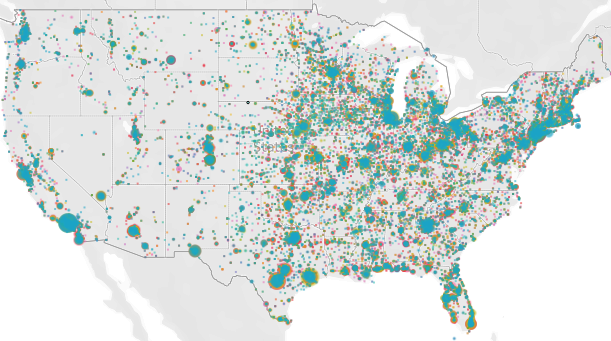

# PPP_Covid_Stimulus

### PPP loans - stimulus money exploration
This project aims to explore and analyze the "Paycheck Protection Program" loan data released by the Small Business Association and made publically available by the U.S. Treasury Department. Otherwise known as "The PPP", these potentially forgivable loans are part of a covid relief package authored by the US Congress in an attempt to assist establishments to retain employees and "stay in business". 

### The data 
Over 4 million rows of data resulted from a compilation of the 51 CSV files downloaded <a href='https://home.treasury.gov/policy-issues/cares-act/assistance-for-small-businesses/sba-paycheck-protection-program-loan-level-data'><strong>here</strong></a>. 50 CSV files have state specific, anonymized information about loans up to 150k. The one remaining CSV is nationwide and reveals the identities of the borrowers who took out loans that go into the millions.

### The approach
Python was used to join the 50 state CSV files and Python Pandas to clean and normalize the data. Taking advantage of the extra horsepower afforded by Google Colab, a preliminary analysis and export of the tightest data (people_ppp.csv) was done using PySpark. Workbooks and scripts are in this repository.

### The plan
Deeper dive into the data which is roughly 4 million rows and spread over several tables. Along with maps, graphs and tables the hope and fun is in finding unforeseen revelations and new lines of inquiry.

### Analysis
This project is currently in progess, but a few visualizations are deployed in Tableau Public and available to view which were done before combining all of the state data, so it reflects only information about smaller loans that were dispersed in  California. The nationwide map displays locations granted over 150k.

Even at this light stage of analysis, there have been some insights gleaned.
- The largest lenders are for the most part "brick and mortar", household names such as Wells Fargo and Bank of America, but there are a few Fintech companies that made the top 10 such as PayPal and Square. 
- Machine learning processing suggests that business type category carries the most weight in terms of the amount of money lent. Race, gender and military status may not.
- The median loan amount was roughly the same as the average for women namely 34k, but male owned businesses borrowed 41k and Veterans the lowest average amount at about 21k. 
- Amongst racial groupings, based on those who responded, the number of Asians who borrowed was double the count of Hispanics despite being a smaller percentage of the population. 

Of course there are potential pitfalls to the above. For example, most borrowers declined to state their race, gender and military service status, so the figures above are based only on respondents who answered and this could inaccurately skew results. 

### Tableau Public
Tableau Public link is here:  <a href='https://public.tableau.com/profile/cerejarosinha#!/vizhome/ppp_loan_analysis/LoansbyLender?publish=yes'><strong>PPP Loan Maps and Preliminary Analysis</strong></a>.

### Frameworks
- Python Pandas
- Tableau
- PySpark
- Python
- Scikit-learn

### Folder Structure
Root:
- Readme.md
### img:
- California and US large loan map
- Female business owners with loans under $150k
#### Tableau:
- Tableau Desktop (.twbx ) includes a data extract.
#### pandas_csv_cleaning:
- Transformation pipline contained in a series of notebooks.
#### python_csv:
- Python script enabling union of the loan data csv files for individual states from Small Business Administration.
#### pyspark_analysis:
- Preliminary exploration of the cleaned data and production of people_ppp.csv file.

#### random_forest:
- Notebook using Pandas.
- Machine learning preparation of data.
- Random Forest regression using Scikit-learn.

### Deployment
- Download the files from the US Treasury linked above, deploy the script in "python_csv" and then run the resulting CSV file through "clean.ipynb" in the "pandas_csv_cleaning" folder. Notes indicate which notebooks to run sequentially. 
- PySpark script utilizes CSV file exported in clean_ppp3.ipynb.

### California map analysis - top lenders

### Where the ladies are - female business loan recipients

